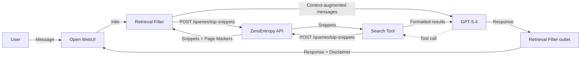
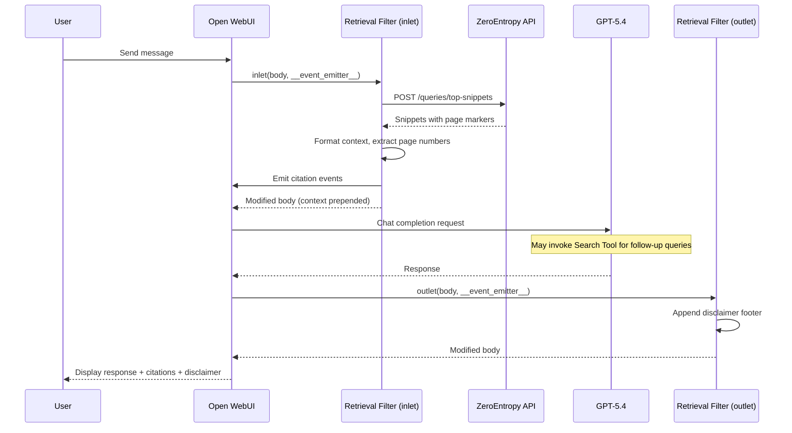

# Design Document: Medical RAG Chatbot

## Overview

This design describes how to configure Open WebUI as a single-purpose RAG medical chatbot ("Rome V Medical Assistant") for a gastroenterology research team. The system is entirely configuration-driven — no core source code modifications are required. All customization is achieved through:

1. A `docker-compose.yaml` file with environment variables that deploy Open WebUI with disabled non-medical features and a persistent disclaimer banner.
2. A **ZeroEntropy Retrieval Filter Function** (Open WebUI Filter plugin) that automatically intercepts every user message, retrieves relevant passages from ~3,700 medical documents via the ZeroEntropy API, injects them as context, and appends a medical disclaimer to every response.
3. A **ZeroEntropy Search Tool Function** (Open WebUI Tool plugin) that the LLM can invoke on-demand for targeted follow-up searches.
4. A **Workspace Model** ("Rome Medical Assistant") that binds GPT-5.4, a medical system prompt, low temperature, the filter, and the tool into a single selectable model.

The retrieval pipeline uses the ZeroEntropy `/queries/top-snippets` endpoint against a collection named `markdown_output`. Snippets contain `<!-- page: N -->` HTML comment markers for page-level citation attribution. Citation events are emitted to the Open WebUI chat UI in real time.



## Architecture

The architecture consists of four configuration artifacts deployed into a stock Open WebUI instance:

### Deployment Layer
- **docker-compose.yaml**: Defines the Open WebUI container with environment variables for OpenAI API connection, feature disablement, default model, authentication, and the disclaimer banner. No Ollama service is included since `ENABLE_OLLAMA_API=false`.

### Plugin Layer
- **Retrieval Filter Function**: A Python class `Filter` with `inlet` and `outlet` methods, registered as a Filter-type function in Open WebUI. The `inlet` method receives the `body` dict (the chat completion request payload) and `__event_emitter__` as parameters. It extracts the user's latest message, queries ZeroEntropy, formats snippets as numbered context blocks, prepends them as a system message, and emits citation events. The `outlet` method appends the medical disclaimer footer to the assistant's response.
- **Search Tool Function**: A Python class `Tools` with a `search_medical_literature` method. Open WebUI injects `__event_emitter__` so the tool can emit status updates and citation events. The LLM invokes this tool when it needs additional context for complex queries.

### Model Layer
- **Workspace Model**: A model configuration record (stored in Open WebUI's database via the admin UI or API) that sets `base_model_id=gpt-5.4`, attaches the filter and tool by their function IDs, configures `temperature=0.2`, `max_tokens=1024`, disables image/code/web capabilities, enables tool use, and includes the medical system prompt with prompt suggestions.

### Data Flow



## Components and Interfaces

### 1. Docker Compose Configuration (`docker-compose.yaml`)

A single-service Docker Compose file (no Ollama) that configures Open WebUI:

| Environment Variable | Value | Purpose |
|---|---|---|
| `OPENAI_API_BASE_URL` | `https://api.openai.com/v1` | OpenAI API endpoint |
| `OPENAI_API_KEY` | `${OPENAI_API_KEY}` | API key from host env |
| `ENABLE_OLLAMA_API` | `false` | Hide local model options |
| `WEBUI_NAME` | `Rome Medical Assistant` | Custom UI title |
| `DEFAULT_MODELS` | `gpt-5.4` | Pre-selected model |
| `ENABLE_IMAGE_GENERATION` | `false` | Disable image gen |
| `ENABLE_COMMUNITY_SHARING` | `false` | Disable sharing |
| `ENABLE_WEB_SEARCH` | `false` | Disable web search |
| `ENABLE_CODE_INTERPRETER` | `false` | Disable code interpreter |
| `WEBUI_AUTH` | `true` | Require authentication |
| `WEBUI_BANNERS` | JSON array (see below) | Medical disclaimer banner |

Port mapping: `3000:8080`. Volume: `open-webui:/app/backend/data`.

Banner JSON structure (matches `BannerModel` schema):
```json
[{
  "id": "medical-disclaimer",
  "type": "warning",
  "content": "⚕️ Research Tool Only — Responses are generated from indexed medical literature and do not constitute medical advice. Always consult qualified healthcare professionals for clinical decisions.",
  "dismissible": false,
  "timestamp": 0
}]
```

### 2. ZeroEntropy Retrieval Filter Function

**Type**: Filter (class named `Filter` with `inlet` and `outlet` methods)

**Valves** (configurable via admin UI):

| Valve | Type | Default | Description |
|---|---|---|---|
| `ZEROENTROPY_API_KEY` | `str` | `""` | ZeroEntropy API key |
| `ZEROENTROPY_BASE_URL` | `str` | `"https://api.zeroentropy.dev/v1"` | ZeroEntropy API base URL |
| `COLLECTION_NAME` | `str` | `"markdown_output"` | Document collection name |
| `SNIPPET_COUNT` | `int` | `5` | Number of snippets to retrieve (`k`) |
| `priority` | `int` | `0` | Filter execution priority |

**`inlet(self, body: dict, __event_emitter__) -> dict`**:
1. Extract the last user message from `body["messages"]`.
2. Use `aiohttp` to POST to `{base_url}/queries/top-snippets` with `{"query": user_message, "collection": collection_name, "k": snippet_count}`.
3. For each returned snippet, extract the page number from the nearest preceding `<!-- page: N -->` marker using regex.
4. Format snippets as numbered context blocks: `[N] Source: {filename}, Page: {page}\n{snippet_text}`.
5. Prepend a system message containing all formatted context to `body["messages"]`.
6. Emit citation events via `__event_emitter__` for each snippet: `{"type": "citation", "data": {"source": {"name": filename}, "metadata": {"page": page}}}`.
7. On ZeroEntropy API failure, emit an error status event and return the unmodified body.

**`outlet(self, body: dict, __event_emitter__) -> dict`**:
1. Find the last assistant message in `body["messages"]`.
2. Append the medical disclaimer footer string.
3. Return the modified body.

### 3. ZeroEntropy Search Tool Function

**Type**: Tool (class named `Tools` with callable methods)

**Valves**:

| Valve | Type | Default | Description |
|---|---|---|---|
| `ZEROENTROPY_API_KEY` | `str` | `""` | ZeroEntropy API key |
| `ZEROENTROPY_BASE_URL` | `str` | `"https://api.zeroentropy.dev/v1"` | ZeroEntropy API base URL |
| `COLLECTION_NAME` | `str` | `"markdown_output"` | Document collection name |

**`search_medical_literature(self, query: str, k: int = 5, __event_emitter__) -> str`**:
1. Emit status event: `"Searching medical literature..."`.
2. Use `aiohttp` to POST to `{base_url}/queries/top-snippets` with `{"query": query, "collection": collection_name, "k": k}`.
3. For each snippet, extract page number from `<!-- page: N -->` markers.
4. Format results as numbered entries with source, page, and text.
5. Emit status event: `"Found N passages"`.
6. Emit citation events for each passage.
7. On failure, return a descriptive error message string.

### 4. Workspace Model Configuration

Created via the Open WebUI admin UI or API. Stored in the `model` database table.

| Field | Value |
|---|---|
| `id` | `rome-medical-assistant` |
| `name` | `Rome Medical Assistant` |
| `base_model_id` | `gpt-5.4` |
| `params.temperature` | `0.2` |
| `params.max_tokens` | `1024` |
| `meta.capabilities` | `{"vision": false, "image_generation": false, "code_interpreter": false, "web_search": false, "tool_use": true}` |
| `meta.filterIds` | `["zeroentropy-retrieval-filter"]` |
| `meta.toolIds` | `["zeroentropy-search-tool"]` |
| `meta.suggestion_prompts` | 6 medical prompt suggestions (IBS criteria, DGBI classification, brain-gut axis, questionnaire validation, functional dyspepsia, RFGES epidemiology) |

**System Prompt** (stored in `meta.system`):
```
You are the Rome V Medical Assistant, a specialized research assistant for the gastroenterology research team. Your expertise covers Disorders of Gut-Brain Interaction (DGBI) and the Rome Foundation diagnostic framework.

Rules:
1. Answer questions ONLY using the retrieved context provided to you. Do not use prior knowledge.
2. For every factual claim, cite the source document name and page number in the format [Source: document_name, Page: N].
3. If the retrieved context is insufficient to answer a question, explicitly state: "The available literature does not contain sufficient information to answer this question."
4. Decline questions outside the scope of gastroenterology and DGBI. Respond with: "This question is outside my area of expertise. I am configured to assist with gastroenterology and DGBI-related research only."
5. Provide structured, evidence-based responses suitable for a research audience.
```

## Data Models

### ZeroEntropy API Request/Response

**Request** (`POST /queries/top-snippets`):
```json
{
  "collection": "markdown_output",
  "query": "What are the Rome V diagnostic criteria for IBS?",
  "k": 5
}
```

**Response**:
```json
{
  "results": [
    {
      "document_path": "rome_v_ibs_chapter.md",
      "snippet": "...text with <!-- page: 42 --> markers..."
    }
  ]
}
```

### Valves Data Model (Filter)

```python
class Valves(BaseModel):
    ZEROENTROPY_API_KEY: str = ""
    ZEROENTROPY_BASE_URL: str = "https://api.zeroentropy.dev/v1"
    COLLECTION_NAME: str = "markdown_output"
    SNIPPET_COUNT: int = 5
    priority: int = 0
```

### Valves Data Model (Tool)

```python
class Valves(BaseModel):
    ZEROENTROPY_API_KEY: str = ""
    ZEROENTROPY_BASE_URL: str = "https://api.zeroentropy.dev/v1"
    COLLECTION_NAME: str = "markdown_output"
```

### Event Emitter Payloads

**Citation Event** (emitted for each retrieved snippet):
```json
{
  "type": "citation",
  "data": {
    "source": {"name": "rome_v_ibs_chapter.md"},
    "metadata": {"page": 42}
  }
}
```

**Status Event** (emitted during tool execution):
```json
{
  "type": "status",
  "data": {"description": "Searching medical literature...", "done": false}
}
```

**Error Status Event** (emitted on ZeroEntropy API failure):
```json
{
  "type": "status",
  "data": {"description": "Error retrieving context: connection timeout", "done": true}
}
```

### Banner Model (Docker environment)

Matches Open WebUI's `BannerModel` schema:
```python
class BannerModel(BaseModel):
    id: str
    type: str           # "warning"
    title: Optional[str] = None
    content: str        # disclaimer text
    dismissible: bool   # False
    timestamp: int      # 0
```

### Workspace Model Schema

Stored in the `model` table, matching `ModelForm`:
```python
{
    "id": "rome-medical-assistant",
    "base_model_id": "gpt-5.4",
    "name": "Rome Medical Assistant",
    "meta": {
        "description": "RAG-powered medical research assistant for DGBI and Rome V diagnostic criteria",
        "capabilities": {
            "vision": False,
            "image_generation": False,
            "code_interpreter": False,
            "web_search": False,
            "tool_use": True
        },
        "filterIds": ["zeroentropy-retrieval-filter"],
        "toolIds": ["zeroentropy-search-tool"],
        "system": "...(system prompt)...",
        "suggestion_prompts": [
            {"title": "IBS Diagnostic Criteria", "content": "What are the Rome V diagnostic criteria for IBS?"},
            {"title": "DGBI Classification", "content": "How has the classification of DGBI evolved from Rome III to Rome V?"},
            {"title": "Brain-Gut Axis", "content": "Explain the brain-gut interaction mechanisms relevant to functional GI disorders."},
            {"title": "Questionnaire Validation", "content": "What diagnostic questionnaires have been validated for DGBI assessment?"},
            {"title": "Functional Dyspepsia", "content": "What are the subtypes of functional dyspepsia and their distinguishing features?"},
            {"title": "RFGES Epidemiology", "content": "What are the key epidemiological findings from the Rome Foundation Global Epidemiology Study?"}
        ]
    },
    "params": {
        "temperature": 0.2,
        "max_tokens": 1024
    },
    "is_active": True
}
```

## Correctness Properties

*A property is a characteristic or behavior that should hold true across all valid executions of a system — essentially, a formal statement about what the system should do. Properties serve as the bridge between human-readable specifications and machine-verifiable correctness guarantees.*

### Property 1: Page marker extraction

*For any* snippet text containing one or more `<!-- page: N -->` HTML comment markers, the page extraction function should return the page number from the nearest preceding marker relative to the snippet content. For snippets with no page markers, the function should return a default value (e.g., `null` or `"unknown"`).

**Validates: Requirements 2.4, 3.8**

### Property 2: ZeroEntropy API request construction

*For any* user query string and any positive integer `k`, the constructed ZeroEntropy API request payload should contain exactly the fields `query` (matching the input query), `collection` (matching the configured collection name), and `k` (matching the input k value), with the POST target being `{base_url}/queries/top-snippets`.

**Validates: Requirements 2.2, 3.2**

### Property 3: Snippet formatting

*For any* list of ZeroEntropy snippet results (each with a `document_path` and `snippet` field), the formatted output should contain one numbered entry per snippet, and each entry should include the source filename and extracted page number.

**Validates: Requirements 2.3, 3.3**

### Property 4: Context injection as system message

*For any* non-empty conversation messages array and any non-empty list of retrieved snippets, after inlet processing the resulting messages array should have a system message prepended that contains all formatted context blocks, and the original messages should remain intact and in order after the injected system message.

**Validates: Requirements 2.5**

### Property 5: Citation event emission

*For any* list of N retrieved snippets (N ≥ 1), the number of citation events emitted should equal N, and each citation event should contain a `type` of `"citation"` with `data` including the source filename and page number matching the corresponding snippet.

**Validates: Requirements 2.6, 3.5**

### Property 6: Outlet disclaimer appending

*For any* assistant response message string, after outlet processing the resulting message content should end with the medical disclaimer footer, and the original response content should be preserved before the disclaimer.

**Validates: Requirements 2.7, 6.2**

### Property 7: Status event emission for tool searches

*For any* successful search returning N results (N ≥ 0), the tool should emit at least two status events: one indicating search initiation and one indicating completion with the correct result count N.

**Validates: Requirements 3.4**

## Error Handling

### ZeroEntropy API Failures (Filter)

When the ZeroEntropy API request fails in the Retrieval Filter's `inlet` method (network timeout, HTTP error, invalid response):
1. Catch the exception in a `try/except` block around the `aiohttp` call.
2. Emit an error status event via `__event_emitter__`: `{"type": "status", "data": {"description": "Error retrieving context: {error_message}", "done": true}}`.
3. Return the original `body` unmodified, allowing the query to proceed to GPT-5.4 without retrieved context.
4. Log the error for debugging.

### ZeroEntropy API Failures (Tool)

When the ZeroEntropy API request fails in the Search Tool's `search_medical_literature` method:
1. Catch the exception.
2. Return a descriptive error string: `"Error searching medical literature: {error_message}. The search could not be completed."`.
3. The LLM will receive this error message and can inform the user accordingly.

### Malformed Snippets

When a snippet lacks `<!-- page: N -->` markers:
- The page extraction function returns a default value (`"N/A"` or `"unknown"`).
- The snippet is still included in the context with the default page indicator.
- Citation events use the default page value.

### Invalid Valves Configuration

When Valves are misconfigured (empty API key, invalid URL):
- The `aiohttp` request will fail, triggering the API failure handling above.
- No special pre-validation is needed; the error propagation path handles this naturally.

### Empty Conversation Messages

When `body["messages"]` is empty or contains no user messages:
- The `inlet` method should return the body unmodified without making an API call.
- This prevents unnecessary ZeroEntropy API requests.

## Testing Strategy

### Dual Testing Approach

This feature requires both unit tests and property-based tests for comprehensive coverage.

**Unit tests** verify specific examples, edge cases, and structural correctness:
- Docker Compose YAML structure validation (all Requirement 1 and 5 criteria)
- Workspace Model configuration validation (all Requirement 4 criteria)
- Filter and Tool class structure (method existence, Valves fields)
- Error handling paths (API failure, empty messages, malformed snippets)
- Banner configuration structure

**Property-based tests** verify universal properties across randomly generated inputs:
- Each correctness property (1–7) maps to exactly one property-based test
- Tests use generated inputs: random query strings, random snippet lists, random page numbers, random message arrays

### Property-Based Testing Configuration

- **Library**: `hypothesis` (Python PBT library)
- **Minimum iterations**: 100 per property test (`@settings(max_examples=100)`)
- **Each property test references its design property via a comment tag**
- **Tag format**: `# Feature: medical-rag-chatbot, Property {N}: {property_title}`

### Test Organization

```
tests/
  test_docker_compose.py          # Unit tests for docker-compose.yaml validation
  test_retrieval_filter.py        # Unit + property tests for the Filter function
  test_search_tool.py             # Unit + property tests for the Tool function
  test_workspace_model.py         # Unit tests for model configuration
  test_page_extraction.py         # Property tests for shared page extraction logic
  test_snippet_formatting.py      # Property tests for shared formatting logic
```

### Property Test Mapping

| Test | Property | Description |
|---|---|---|
| `test_page_marker_extraction` | Property 1 | Generate random snippet texts with embedded page markers at random positions; verify extraction returns the correct nearest preceding page number |
| `test_api_request_construction` | Property 2 | Generate random query strings and k values; verify the constructed payload matches expected structure |
| `test_snippet_formatting` | Property 3 | Generate random lists of snippet objects; verify formatted output contains numbered entries with source and page |
| `test_context_injection` | Property 4 | Generate random message arrays and snippet lists; verify system message is prepended and originals preserved |
| `test_citation_event_emission` | Property 5 | Generate random snippet lists; verify citation event count and content match |
| `test_outlet_disclaimer` | Property 6 | Generate random response strings; verify disclaimer is appended and original content preserved |
| `test_status_events` | Property 7 | Generate random result counts; verify status events include initiation and completion with correct count |

### Unit Test Coverage

- **Requirement 1 (Docker)**: Parse `docker-compose.yaml` with PyYAML, assert each environment variable, port mapping, volume, and image.
- **Requirement 4 (Workspace Model)**: Validate the model JSON configuration against expected schema and values.
- **Requirement 6 (Disclaimers)**: Verify banner JSON structure and outlet disclaimer text content.
- **Edge cases**: Empty messages array, snippets without page markers, API timeout simulation, empty API key in Valves.
